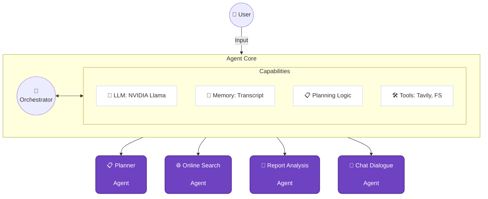

# Deep Research Assistant: 
###Application Architecture
Modeled after a Hub-and-Spoke Agent pattern, the architecture consists of a central "Agent Core" that leverages different subsets of capabilities and dispatches tasks to specialized sub-agents.

React + Express + Deep Agents + CopilotKit clone of the CopilotKit deep agents 

## Stack

- React with Vite
- Node.js + Express
- `deepagents` for the research agent
- CopilotKit chat UI
- AG-UI style agent integration through a custom `AbstractAgent`

## Run

1. Copy `.env.example` to `.env`
2. Set `NVIDIA_API_KEY` and `TAVILY_API_KEY`
3. Run `npm install`
4. Run `npm run dev`

## Build

Run `npm run build`

## Deployment

The application is architected to run as two distinct services in production: a static frontend and a persistent backend API.

### 1. Backend (Render)

Deploy the Express server responsible for AI orchestration, LangChain processing, and API integrations.

1. **Host**: [Render.com](https://render.com) (Create a new "Web Service")
2. **Repository**: Point to your GitHub repo
3. **Configuration**:
    - Build Command: `npm install`
    - Start Command: `npm run start`
    - Root Directory: `server`
4. **Environment Variables**:
    - `NVIDIA_API_KEY`: (Your NVIDIA developer key)
    - `TAVILY_API_KEY`: (Your Tavily research key)

### 2. Frontend (Vercel)

Deploy the Vite + React client.

1. **Host**: [Vercel.com](https://vercel.com) (Add a new "Project")
2. **Repository**: Point to your GitHub repo
3. **Configuration**:
    - Framework Preset: `Vite`
    - Root Directory: `client`
4. **Environment Variables**:
    - `VITE_API_URL`: The URL of your deployed render backend appendeed with `/api/copilotkit` (e.g. `https://your-backend.onrender.com/api/copilotkit`).

## Notes

- The app keeps the split layout, workspace panel, research plan updates, source tracking, and file output flow from the original demo.
- The client proxies `/api/*` to the Express server during local development.
- The agent now uses NVIDIA's OpenAI-compatible chat API via `https://integrate.api.nvidia.com/v1` while keeping the LangChain client layer unchanged.

